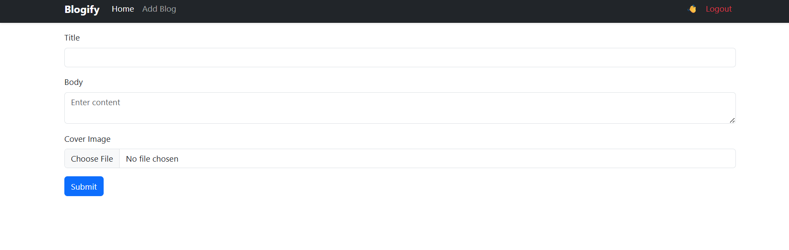
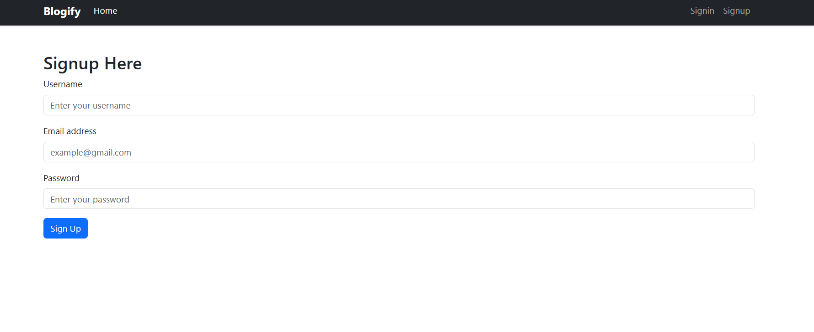

# 📝 Blog Application (Node.js + Express + MongoDB)

A full-stack **blog application** built using **Node.js, Express, MongoDB, and EJS**.
Users can register, log in, create blogs with cover images, and view author profiles.

---

## 🚀 Features

- 👤 User Authentication (Register / Login)
- 🔐 Secure password hashing with salt (Crypto)
- 📝 Create & view blog posts
- 🖼 Upload blog cover images
- 👤 User profile image support
- 🧑‍💼 Role-based users (ADMIN / USER)
- 📁 Static file handling with Express
- 🎨 Server-side rendering using EJS

---

## 🗂 Project Structure

├── controllers/      # Route controllers

├── frontend_pic/     # Screenshots of the frontend

├── middleware/       # Custom middlewares (auth, etc.)

├── models/           # Mongoose models

├── public/           # Static files (images, uploads, css)

│   ├── uploads/

│   └── user.png

├── routes/           # Express routes

├── services/         # Auth & helper services

├── views/            # EJS templates

│   └── partials/

├── app.js            # Main app entry

├── conn.js           # MongoDB connection

├── .env              # Environment variables

├── package.json

└── README.md

<pre class="overflow-visible! px-0!" data-start="1389" data-end="2035"><div class="contain-inline-size rounded-2xl corner-superellipse/1.1 relative bg-token-sidebar-surface-primary"><div class="sticky top-[calc(--spacing(9)+var(--header-height))] @w-xl/main:top-9"><div class="absolute end-0 bottom-0 flex h-9 items-center pe-2"><div class="bg-token-bg-elevated-secondary text-token-text-secondary flex items-center gap-4 rounded-sm px-2 font-sans text-xs"></div></div></div><div class="overflow-y-auto p-4" dir="ltr"></div></div></pre>

---

## 🖼 Screenshots

## 🏠 Homepage


### 📝 Blog Post Page



### 🔐 SignUp Page



## 🛠 Tech Stack

- **Backend:** Node.js, Express.js
- **Frontend:** EJS, Bootstrap
- **Database:** MongoDB, Mongoose
- **Authentication:** JWT
- **Security:** Crypto (HMAC + Salt)
- **File Uploads:** Multer
- **Environment:** dotenv

---

## ⚙️ Installation & Setup

### 1️⃣ Clone the repository

```bash
git clone https://github.com/your-username/blog-app.git
cd blog-app
```

### 2️⃣ Install dependencies

```
npm install
```

### 3️⃣ Setup `.env`

```
PORT=3000
MONGODB_URI=your_mongodb_connection_string
JWT_SECRET=your_secret_key
```

### 4️⃣ Run the application

```
npm start
```
